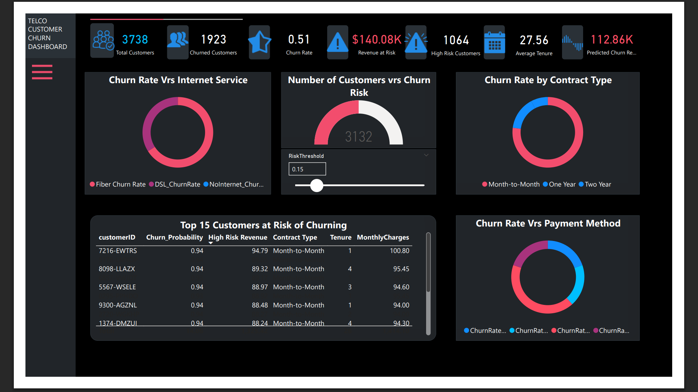

# 📉 Customer Churn Analysis & Prediction

A complete data-driven project to analyze, predict, and visualize customer churn using machine learning models and Power BI.

---

## 🧠 Project Overview

This project aims to identify customers who are likely to churn and understand the factors driving churn behavior. By combining predictive modeling with interactive Power BI dashboards, it supports data-driven decision-making to improve customer retention strategies.

---

## 📁 Repository Structure

```
📆 churn-analysis/
🗂️ data/                  # Cleaned and raw CSV datasets
🗂️ notebooks/             # Jupyter notebooks for EDA, modeling
🗂️ powerbi/               # Power BI .pbix files and exports
🗂️ models/                # Trained model files (optional)
🗂️ visuals/               # Screenshots or exported visuals
🗄 README.md              # Project overview
```

---

## 🔍 Dataset

- **Source**: Kaggle
- **Columns Include**:
  - Customer demographics (gender, senior, dependents)
  - Account info (contract type, tenure, payment method)
  - Services (internet, streaming, tech support, etc.)
  - Target: `Churn` (Yes/No), `Churn_Predicted`, `Churn_Probability`

---

## ⚙️ Tools & Technologies

- **Languages**: Python (Pandas, Scikit-Learn), DAX
- **Platform**: Power BI (Desktop)
- **ML**: Logistic Regression
- **Visualization**: Power BI Interactive Dashboard

---

## 🧪 Modeling Approach

This project focused on building an effective churn prediction model using **Logistic Regression** as the primary classifier.

To enhance performance and interpretability:

1. A **Decision Tree Classifier** was used for feature selection to reduce noise and highlight the most important features.
2. **Hyperparameter tuning** was conducted by looping over different values of the inverse regularization strength (`C`) to optimize model performance.

After evaluation, the **finalized Logistic Regression model** was selected based on:

- ✅ Best performance across classification metrics (accuracy, precision, recall)
- ✅ Strong generalization with the optimized `C` parameter
- ✅ Clear interpretability for business decision-making


> **Final predictions were generated using the Linear Regression model.**


## 📊 Dashboard Features

- KPI Cards: Total customers, churn rate, revenue at risk
- Interactive Slider: Set churn probability threshold
- Pie/Donurt Charts: Churn breakdown by gender, contract, payment method
- Table: Top at-risk customers
- Histogram: Distribution of churn probability
- Donuts: Churn by services

> 📌 See screenshots in `/visuals` or open the `.pbix` file.


---

## 🧪 ML Model

- Binary classification: Predict if a customer will churn
- Features engineered from one-hot encoded variables
- Outputs:
  - `Churn_Predicted` (0 or 1)
  - `Churn_Probability` (0–1)

---

## 🚀 How to Use

1. Clone the repo:

   ```bash
   git clone https://github.com/Pathogenic-cmd/telco-churn-analysis.git
   ```

2. Open Power BI Desktop and load:

   - `churn_predictions.csv` (in `data/`)
   - or the full `.pbix` file (in `powerbi/`)

3. Use the **RiskThreshold slider** to explore churn dynamics interactively.

---

## 📈 Sample Results

| Contract Type  | High-Risk Customers | Churn Rate |
| -------------- | ------------------- | ---------- |
| Month-to-Month | 650                 | 42.6%      |
| One Year       | 120                 | 11.8%      |
| Two Year       | 85                  | 6.3%       |

---

## 🛠 Future Improvements

- Integrate with live scoring via Power Automate
- Add Power Apps form for entering new customer data
- Extend to multi-class churn causes

---

## 🧃 License

[MIT License](LICENSE)

---

## 🙌 Acknowledgments

- Inspired by Telco Churn use cases
- Thanks to [Kaggle / IBM Sample Dataset] for data

